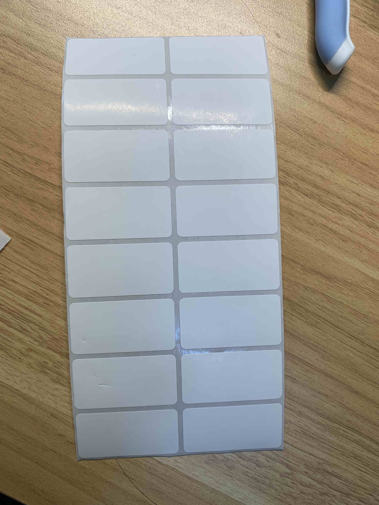

# Introduction

This tool is a node cmd program to generate PDF files to print labels with my printer.




# Setup log

```
yarn init
yarn add jspdf
```

[support chinese font](https://github.com/parallax/jsPDF#use-of-unicode-characters--utf-8)
download [source-han-sans](https://github.com/be5invis/source-han-sans-ttf/releases)

add to `assets` folder

# Usage

```
yarn install
node src/pdf-gen.js 测试
```

# Useful links

[jsPDF document](http://raw.githack.com/MrRio/jsPDF/master/docs/index.html)
[jsPDF node examples](https://github.com/parallax/jsPDF/tree/master/examples/node)
[jsPDF online demo](https://parall.ax/products/jspdf)
